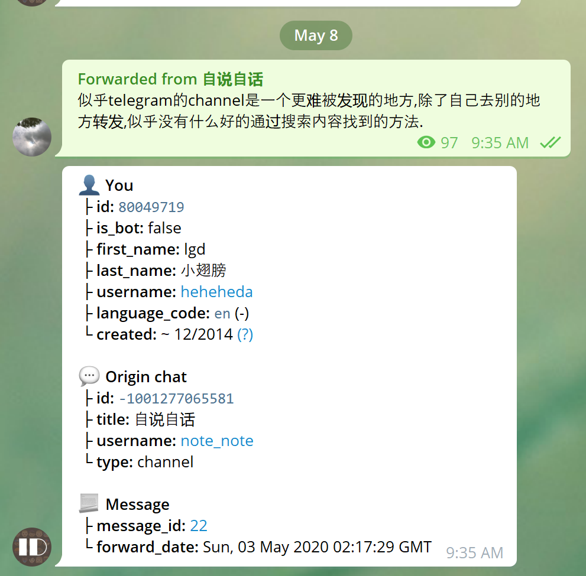

# BeeBeep
## Introduction


BeeBeep is a very very easy tool to notify me after some command finished.

In every day developing work, I need to build some projects. Usually, it cost a long time to finish. So I will do other work, when the build process is running. If I want to check whether it is finished, I need to always open the terminal to see the results. It is a waste of the time. So I wrote this small tool to notify me when the given command is finished.

## How to use it?
Of course, it is very easy to use. Just apply for a private channel and  get the token.

The configuration file is located in `.env` file, you can rename the `example.env` to `.env` and change the token and channel id.

It is easy to get the channel ID, just forward a message to [getidsbot](https://t.me/getidsbot).



There is a configuration for a default command, I set this to my build command as this is my most used command.

```
CHANNELID=-1001274384801
TOKEN=1289316089:AAFRB6u-P2F6RzzZX43ZqPvl5MjFH4eIDB8
DEFAULT_COMMAND=ls
```

This configuration will invoke [@beebeep_test_bot](https://t.me/beebeep_test_bot) to send a message to [beebeep](https://t.me/beebeep_test).
